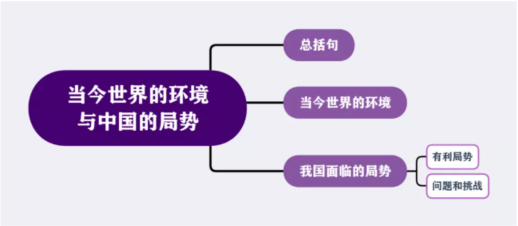

# Day17
## T1当今世界的环境与中国的局势

今天这段素材叫——当今世界的环境与中国的局势。

这段素材太厉害了！它的使用面特别的广！今年我们在写毛中特、甚至在写当代世界政治与经济的分析题的时候，都能用到这段素材：要么就整段用，要么就用到其中的部分段落和文字。

这段素材的内容有点多，我们可以分为几个不同的层次来进行背诵，我给你们画了背诵层次图：

背诵内容

第一个层次是总括性的说法：

当前和今后一个时期，我国发展仍然处于重要战略机遇期，但机遇和挑战都有新的发展变化。

第二个层次是当今世界的环境：

当今世界正经历百年未有之大变局，新一轮科技革命和产业变革深入发展，国际力量对比深刻调整，和平与发展仍然是时代主题，人类命运共同体理念深入人心，同时国际环境日趋复杂，不稳定性不确定性明显增加。

（这段话特别厉害！今年考试在写分析题的时候十有八九会写到这段话的！）

第三个层次就是对我国面临的局势进行全面的展开，我国的局势要分正反两方面：一方面先写我们的有利的局势；另一方面是存在着的挑战和不利的地方。

我国面临的有利局势：我国已转向高质量发展阶段，制度优势显著，治理效能提升，经济长期向好，物质基础雄厚，人力资源丰富，市场空间广阔，发展韧性强劲，社会大局稳定，继续发展具有多方面优势和条件；

我国面临的挑战：同时我国发展不平衡不充分问题仍然突出，重点领域关键环节改革任务仍然艰巨，创新能力不适应高质量发展要求，农业基础还不稳固，城乡区域发展和收入分配差距较大，生态环保任重道远，民生保障存在短板，社会治理还有弱项。

（这两段话都写上的话，我们对我国所面临的局势的描述就非常的完整而丰富了）

