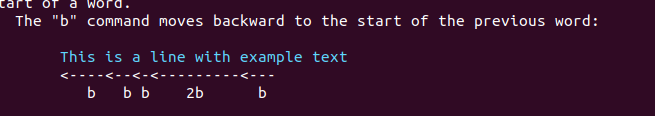

# VIM HELP

## 关于移动

h ---left j---down k---up l---right

## :help x 查看普通模式的命令

## :help v_u 查看可视化模式的命令

## :help i_ 查看插入模式的命令

## :help ： 查看命令模式的命令

# :help usr_o2.txt vim的第一步

:set showmode 查看当前你在哪个模式

单词之间的移动           w 

e 命令可以移动到单词的最后一个字母，ge 将光标移动到上一次旧的位置

