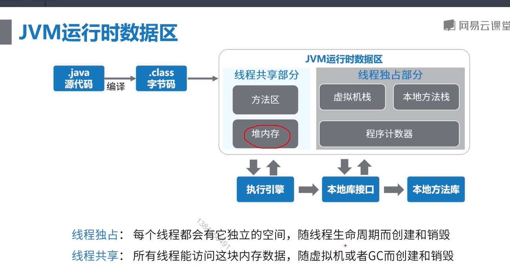
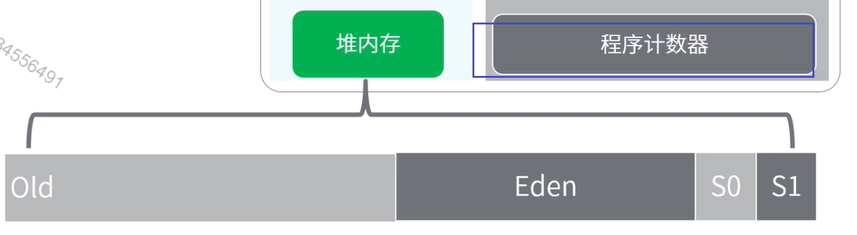

**堆内存**可以细分为：老年代、新生代（Eden、From Survivor、To Survivor）

jvm 启动时创建，存放对象的实例。垃圾回收器就是管理堆内存。

如果heap 满了，会出现OutOfMemoryError。

**虚拟机栈：**每个线程都在这个空间有一个私有的空间。

线程栈由多个栈帧（ Frame）组成。

一个线程会执行一个或多个方法，一个方法对应一个栈帧。

**栈帧** 包含 变量表，操作数栈，动态链接，方法返回地址，附加信息等。

栈内存默认大小是1M,超出会抛出StackOverFlowError。

**本地方法栈** 和虚拟机功能类似，虚拟机栈是为虚拟机执行java方法而准备的，本地方法栈是为虚拟机使用native方法而准备的。

超出大小会抛出StackOverFlowError

 **程序计数器** 记录的是当前线程执行字节码的位置，存储的是字节码的指令地址，如果是native方法，计数器值为空。

每个线程都在这个空间有一个私有的空间，占用内存空间很小。

CPU同一时间，只会执行一条线程中的指令。jvm多线程会轮流切换被分配CPU执行时间的方式。为了线程切换后，需要通过程序计数器，来恢复正常的执行位置。

 

